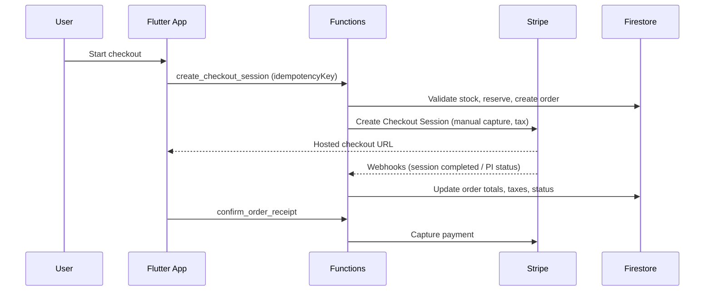

# OrignaGTA Monorepo

This repo contains:
- Flutter app: origna_gta
- Firebase Functions backend: functions

## Architecture overview
- MVVM in Flutter
- Functions own payment/shipping validation
- Idempotent payment and webhook processing
- Product ratings are submitted via Cloud Function (server-validated)

## Security hardening (2026-01-31)
**Audit Score**: 9.2/10 ✅ Production Ready | [Full Report](docs/SECURITY_AUDIT_2026_01_31.md)

- ✅ **CRITICAL**: Server-side price validation (cart items vs DB products, tolerance 1 cent)
- ✅ **CRITICAL**: Server-side shipping/tax recalculation (client values ignored)
- ✅ **CRITICAL**: Subtotal verification (1% tolerance, rejects tampering)
- ✅ **HIGH**: Authorization timeout tracking (7 days max, daily cronjob cancels expired)
- ✅ **MEDIUM**: Uniform email validation across all auth flows (no consecutive dots, strict TLD)
- ✅ **LOW**: Webhook signature errors masked in production logs
- ✅ Rate limiting: 10 req/5min per user/IP on checkout (rate_limiter.py)
- ✅ Debug prints wrapped in IS_EMULATOR checks (no sensitive data in prod logs)
- ✅ Firestore rules enforce field lengths, postal code format, and product constraints
- ✅ CSP: removed 'unsafe-eval', kept 'unsafe-inline' for Flutter Web
- ✅ Idempotent payments with client-supplied + Stripe keys
- ✅ Atomic stock transactions prevent race conditions

## Phase 3.5: Edge Case Fixes (2026-02-02)
**Status**: ✅ Complete | [Full Audit](EDGE_CASES_AUDIT.md)

**6 Critical Edge Cases Fixed**:
1. ✅ **Seller Suspension** (URGENT): `suspend_seller()` Cloud Function - auto-cancels orders, refunds buyers, restores stock
2. ✅ **Multi-Seller Capture** (URGENT): Per-seller tracking via `sellerCaptures` dict - prevents double-charging
3. ✅ **Auto-Capture Failure** (HIGH): Tracks `captureAttempts`, flags for manual review after 3 failures
4. ✅ **Rate Limiter Race** (HIGH): Transaction-based rate limiting - atomic increment prevents bypass
5. ✅ **Product Deletion** (MEDIUM): Pre-delete check for active orders - prevents stock issues
6. ✅ **Dispute Fraud** (MEDIUM): Fraud scoring system (30-90pts) - flags post-delivery disputes

**New Collections**:
- `security_alerts`: Immutable audit log for fraud/suspension events (admin read-only)

**New Order Fields**:
- `sellerCaptures`: Per-seller capture tracking
- `captureAttempts`: Auto-capture failure counter
- `requiresManualReview`: Admin intervention flag
- `fraudScore`: Dispute risk score (0-100)

**Cronjobs**:
- `check_expired_authorizations_scheduled`: Daily 2 AM UTC (cancels expired payment holds)

## End-to-end flow (payments)


## Quick commands
- Run all tests: scripts/run_all_tests.sh
- Run strict quality gate locally in safe mode: ./scripts/run_quality_gate.sh
- Force full local strict gate (not recommended on 8GB RAM): ./scripts/run_quality_gate.sh --allow-local-heavy --backend-gate-mode strict
- Strict quality gate (100% + real E2E): scripts/run_quality_gate.sh
- Real browser E2E smoke: scripts/run_real_e2e_smoke.sh
- Deploy Firestore rules: scripts/deploy_rules.sh
- Install pre-push hook (safe local checks by default): scripts/install_git_hooks.sh
- Firestore indexes: firebase deploy --only firestore:indexes
- Flutter analyze: (cd origna_gta) flutter analyze
- Flutter tests: (cd origna_gta) flutter test
- Functions tests: (cd functions) pytest
- Configure Algolia index: Call `configure_algolia` Cloud Function (admin only)

## Flutter integration tests
```bash
# Lightweight local command
cd origna_gta
flutter test integration_test/coverage_gate_integration_test.dart
```

- The enforced 100% integration coverage gate runs remotely in GitHub Actions on Linux desktop and in Codemagic on macOS.
- Local heavy integration/device runs are intentionally not the default because this repository targets an 8GB developer machine.

## Quality gates and CI
- GitHub Actions workflow: `.github/workflows/strict-quality-audit.yml`
  - Enforces backend coverage at 100%
  - Enforces Flutter unit coverage at 100%
  - Enforces Flutter integration coverage at 100%
  - Runs the real Playwright buyer/seller/order flows
  - Enforces Playwright coverage at 100%
- Codemagic workflow: `origna_gta/codemagic.yaml` → `quality-gate-remote`
- Local `./scripts/run_quality_gate.sh` defaults to backend-only safe mode unless `--allow-local-heavy` is set.
- Installed pre-push hook defaults to lightweight local checks only.
  - Force heavy local pre-push validation: `ALLOW_LOCAL_HEAVY_PRE_PUSH=1 git push`
  - Force local deploy from the hook: `RUN_PRE_PUSH_DEPLOY=1 git push`
  - Default expectation: use GitHub Actions / Codemagic for heavy gates and deploy verification.

## CI / E2E
- GitHub Actions runs backend + Flutter tests and the strict real-flow Playwright suite remotely.
- Local E2E stack:
  - Start: `./scripts/start-e2e-services.sh`
  - Run: `(cd e2e && E2E_WORKERS=2 ./run-e2e-tests.sh flutter)`
  - Stop: `./scripts/stop-e2e-services.sh`
- Flutter web integration test:
  - Run: `./scripts/run_flutter_integration_tests_web.sh integration_test/app_test.dart`
- Playwright parallelism:
  - `E2E_WORKERS` overrides the worker count (CI uses a conservative default).
  - `E2E_PROJECT` can force a single browser project (e.g. `chromium`).
- Screenshots auto-saved to `~/Desktop/origna-screenshots/<env>/` after each run.

### Key real-flow specs — `e2e/playwright_ui/`

| Spec | Coverage |
|------|----------|
| `stripe-payment.spec.ts` | Stripe hosted checkout |
| `buyer-flow.spec.ts` | Browse → cart → checkout → order |
| `seller-flow.spec.ts` | List product → ship → payout |
| `order-lifecycle.spec.ts` | Full order state machine |
| `order-cancellation-refund.spec.ts` | Cancel + return + refund |
| `shipping-approval.spec.ts` | Shipping cost approval |
| `shipping-calculation.spec.ts` | Province/distance/weight pricing |
| `checkout-validation.spec.ts` | Form validation + coupons |
| `payment-edge-cases.spec.ts` | Declined card, 3DS |
| `multi-seller-orders.spec.ts` | Cross-seller cart + auth |
| `add-product-e2e.spec.ts` | Add product + images + warehouse |
| `seller-product-management.spec.ts` | Edit/pause/archive products |
| `seller-registration.spec.ts` | Stripe Connect onboarding |
| `warehouse-multi-location.spec.ts` | Warehouse CRUD |
| `digital-product-e2e.spec.ts` | Buy digital + license |
| `premium-subscription.spec.ts` | Subscribe + paywall + cancel |
| `favorites.spec.ts` | Toggle + list favorites |
| `profile-management.spec.ts` | Profile + address CRUD |
| `search-products.spec.ts` | Algolia search + filters |
| `trending-products.spec.ts` | Trending section |
| `admin-actions.spec.ts` | Admin product/user actions |
| `admin-panel.spec.ts` | Admin panel tabs |
| `admin-security.spec.ts` | Role enforcement |
| `edge-cases-security.spec.ts` | Self-purchase, price tamper, race |
| `rate-limiting.spec.ts` | Rate limit enforcement |
| `new-coverage-e2e.spec.ts` | Additional subscription + stock notification coverage |
| `smoke-home-profile.spec.ts` | App smoke tests |

Coverage-specific gate files:
- `origna_gta/test/coverage_gate_test.dart`
- `origna_gta/integration_test/coverage_gate_integration_test.dart`
- `e2e/playwright_ui/coverage-gate.spec.ts`
- `e2e/playwright_ui/coverage_gate.ts`

## origna_flows/ — AI Flow Context Bundles

Source and test files bundled for Claude.ai per-flow auditing.

```bash
python3 scripts/collect_flow_files.py
# → ~/Desktop/origna_flows/<flow_name>/  (62 flows, ≤20 files each)
```

| Type | Count | Purpose |
|------|-------|---------|
| Audit flows (`checkout_payment`, `security`, …) | 35 | Drop into Claude.ai → audit source code |
| Test flows (`test_stripe_payment`, …) | 27 | Drop into Claude.ai → audit/extend E2E tests |

Each test flow: spec file + `api-helpers.ts` + `flutter-helpers.ts` + `origna_flows/SEMANTICS.md` + supporting source.

Repo docs (`origna_flows/`):
- `SEMANTICS.md` — Flutter Key/label/role map for every screen
- `FLOWS.md` — 15 user journeys with step-by-step test assertions
- `INSTRUCTIONS.md` — Playwright patterns, selectors, coverage gaps, environments


## Flutter Web performance (release checklist)
- Measure in profile mode:
  - `cd origna_gta && flutter run -d chrome --profile`
- Capture a trace in Chrome DevTools (Performance tab) on:
  - cold start (first meaningful paint)
  - home feed scroll
  - add-to-cart → checkout navigation
- Keep an eye on:
  - excessive rebuilds (Flutter DevTools)
  - large images (ensure resize/compress, cache headers)
  - expensive JSON parsing on UI thread (move to isolates if needed)

## Search Architecture (Algolia)
- **Primary Search**: Algolia for fast, typo-tolerant product search
- **Fallback**: Firestore keyword search if Algolia unavailable
- **Auto-Indexing**: Products automatically synced to Algolia via Firestore triggers
- **Credentials**: Stored in Firebase Remote Config and Google Secret Manager
  - `ALGOLIA_APP_ID` (public)
  - `ALGOLIA_SEARCH_API_KEY` (search-only, frontend-safe)
  - `ALGOLIA_WRITE_API_KEY` (backend-only, in Cloud Functions)

**Algolia Features**:
- Instant search with debouncing (500ms)
- Category filtering
- Searchable attributes: name, description, keywords
- Firestore field name: keywords (array) for both Algolia and fallback
- Custom ranking: rating → ratingCount → createdAt
- Highlighting enabled
- 20 results per page

**Setup**:
1. Add keys to `.env` and Firebase Remote Config
2. Deploy Cloud Functions: `firebase deploy --only functions`
3. Configure index settings: Call `configure_algolia` function once
4. Products auto-index on create/update/delete

## Docs
- App README: origna_gta/README.md
- Functions README: functions/Readme.md

## Environments
- **Development**: `flutter run -d chrome --dart-define=ENVIRONMENT=dev`
- **Staging**: `flutter run -d chrome --dart-define=ENVIRONMENT=staging`
- **Production**: `flutter run -d chrome --dart-define=ENVIRONMENT=production` (Default)
- **Emulators**: `flutter run -d chrome --dart-define=ENVIRONMENT=emulator`

### Deployment
Deploy backend/hosting to specific environment:
```bash
# Dev
firebase use dev
firebase deploy
# Staging
firebase use staging
firebase deploy
# Prod
firebase use prod
firebase deploy
```

## Architecture Notes
- Canada-only delivery enforced in Functions (buyer/shipping addresses only; sellers can be worldwide).
- Stripe Connect Express direct charges, manual capture.
- Algolia search with Firestore fallback.
