# OrignaGTA — System Architecture

**Version:** 1.0.0
**Date:** 2026-03-02
**Platform:** Canadian e-commerce marketplace. Canadian buyers, worldwide sellers.
**Production URL:** https://www.orignagta.ca

---

## Table of Contents

1. [System Overview](#1-system-overview)
2. [Repository Structure](#2-repository-structure)
3. [Database Schema (Firestore Collections)](#3-database-schema-firestore-collections)
4. [Application Screens & Navigation](#4-application-screens--navigation)
5. [Authentication Flow](#5-authentication-flow)
6. [Payment Flow (Complete)](#6-payment-flow-complete)
7. [Order Lifecycle State Machine](#7-order-lifecycle-state-machine)
8. [Seller Onboarding Flow](#8-seller-onboarding-flow)
9. [Product Lifecycle](#9-product-lifecycle)
10. [Cron Jobs & Background Processes](#10-cron-jobs--background-processes)
11. [Cloud Functions Catalog](#11-cloud-functions-catalog)
12. [Frontend Architecture (MVVM)](#12-frontend-architecture-mvvm)
13. [Security Architecture](#13-security-architecture)
14. [Canadian Legal Compliance](#14-canadian-legal-compliance)

---

## 1. System Overview

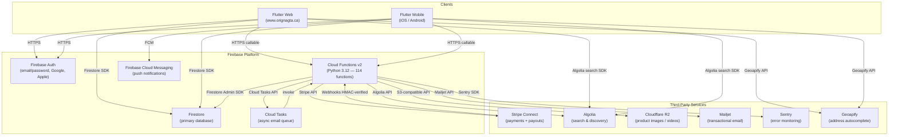

### Key Design Decisions

| Decision | Choice | Rationale |
|----------|--------|-----------|
| Payment model | Stripe Separate Charges & Transfers | One checkout session covers multiple sellers; per-seller Transfer after delivery |
| Capture timing | Automatic capture at checkout | Simplifies flow vs manual capture; no 7-day expiry window risk |
| Search | Algolia | Sub-100ms search; Firestore queries cannot sort by relevance |
| Image storage | Cloudflare R2 | S3-compatible, cheaper egress than GCS |
| State management | Riverpod MVVM | Zero logic in screens; full testability; no `setState` |
| Schema constants | Triple-synced: Python / Dart / JSON | Single source of truth prevents cross-stack bugs |

---

## 2. Repository Structure

```
origna_gta/
├── functions/                      # Python Cloud Functions backend
│   ├── main.py                     # Function registration entry point
│   ├── schema_constants.py         # ALL field names, enums, collection names (525 lines)
│   ├── config.py                   # Environment config (dev / staging / prod)
│   ├── handlers/                   # Feature-based function handlers
│   │   ├── payment_stripe.py       # Stripe: checkout, webhooks, Connect, disputes
│   │   ├── orders.py               # Order state machine, returns, shipping approval
│   │   ├── products.py             # Product CRUD, Algolia sync, ratings, Q&A
│   │   ├── users.py                # Profile CRUD, email consent
│   │   ├── admin.py                # Roles, suspension, MFA, GDPR compliance
│   │   ├── chat.py                 # Real-time buyer-seller chat (Premium)
│   │   ├── subscriptions.py        # Premium membership
│   │   ├── coupons.py              # Discount coupons
│   │   ├── digital.py              # Digital product licenses & downloads
│   │   ├── addresses.py            # Buyer shipping address management
│   │   ├── shipping.py             # Shipping cost calculation wrapper
│   │   ├── payment_providers.py    # Admin payment provider toggle
│   │   ├── cron_jobs.py            # 15 scheduled background jobs
│   │   └── email_tasks.py          # Async email task handler
│   ├── models/                     # Pydantic data models
│   │   ├── base.py                 # OrderStatus, PaymentStatus enums
│   │   ├── order.py                # Order, OrderItem
│   │   ├── product.py              # Product, ShippingConfig
│   │   └── user.py                 # User, SellerProfile
│   ├── services/                   # Shared service layer
│   │   ├── email_service.py        # Mailjet: all HTML templates
│   │   ├── algolia_service.py      # Algolia index sync
│   │   ├── shipping_service.py     # Shipping cost + tax calculation
│   │   ├── rate_limiter.py         # Per-IP/user rate limiting via Firestore
│   │   ├── push_service.py         # FCM push notifications
│   │   ├── pdf_invoice_service.py  # PDF invoice generation
│   │   └── email_task.py           # Cloud Tasks email queue helper
│   └── tests/                      # 449 pytest tests across 35 files
│
├── origna_gta/                     # Flutter application
│   └── lib/
│       ├── main.dart               # App entry point
│       ├── origna_app.dart         # Router, theme, deep link handling
│       ├── core/
│       │   ├── providers.dart      # Global Riverpod providers
│       │   ├── routes.dart         # AppRoutes constants
│       │   ├── schema/
│       │   │   └── schema_constants.dart  # Dart mirror of schema_constants.py
│       │   └── repositories/       # Firestore + Algolia data access layer
│       ├── features/               # MVVM: ViewModel + State per feature
│       │   ├── auth/               # Login, registration, auth state
│       │   ├── cart/               # Cart management
│       │   ├── checkout/           # Checkout orchestration
│       │   ├── home/               # Home screen + search
│       │   ├── orders/             # Buyer & seller order management
│       │   ├── products/           # Product CRUD, ratings, actions
│       │   ├── seller/             # Seller registration & onboarding
│       │   ├── chat/               # Buyer-seller chat (Premium)
│       │   ├── subscription/       # Premium subscription
│       │   ├── app/                # Seller account status monitoring
│       │   └── terms/              # Terms acceptance tracking
│       ├── screens/                # Pure UI — zero business logic
│       ├── models/
│       │   └── generated/          # Freezed data models (auto-generated)
│       ├── services/               # Algolia client, analytics, notifications
│       ├── widgets/                # Reusable UI components
│       └── utils/                  # env_config, design_tokens
│
├── firestore.rules                 # Firestore security rules
├── firestore.indexes.json          # Composite indexes
├── storage.rules                   # Storage security rules
├── docs/                           # Architecture & compliance docs
├── e2e/playwright_ui/              # 36 Playwright E2E test specs
├── origna_flows/                   # AI flow context bundles (62 flows)
└── scripts/                        # Dev tooling, deploy, seed, audit
```

---

## 3. Database Schema (Firestore Collections)

### Top-Level Collections

| Collection | Document ID | Purpose | Key Fields |
|-----------|------------|---------|------------|
| `users` | Firebase UID | User accounts (buyers, sellers, admins) | `roles[]`, `email`, `customerId` (Stripe), `suspended`, `emailVerified` |
| `products` | auto-generated | Product listings | `name`, `price` (CAD), `sellerId`, `stock`, `lifecycleStatus`, `isActive`, `algoliaObjectId` |
| `orders` | auto-generated | Purchase orders | `buyerId`, `sellerId`, `status`, `paymentStatus`, `items[]`, `totalAmount`, `stripeSessionId` |
| `seller_profiles` | Firebase UID | Seller Stripe Connect details | `stripeAccountId`, `onboardingCompleted`, `chargesEnabled`, `payoutsEnabled` |
| `subscriptions` | Firebase UID | Premium membership | `status` (active/trialing/canceled), `stripeSubscriptionId`, `currentPeriodEnd` |
| `chats` | auto-generated | Buyer-seller chat threads (Premium) | `buyerId`, `sellerId`, `productId`, `messages[]` (subcollection) |
| `product_ratings` | auto-generated | Product reviews | `productId`, `buyerId`, `rating`, `comment`, `orderId` |
| `product_questions` | auto-generated | Product Q&A | `productId`, `buyerId`, `question`, `answer`, `answeredAt` |
| `coupons` | coupon code | Discount coupons | `type` (platform/seller), `discountType`, `value`, `expiresAt`, `usageLimit` |
| `licenses` | license key | Digital product licenses | `productId`, `buyerId`, `status`, `activationCount`, `maxActivations` |
| `refunds` | auto-generated | Refund records | `orderId`, `amount`, `reason`, `stripeRefundId`, `status` |
| `return_requests` | auto-generated | Return request workflow | `orderId`, `buyerId`, `reason`, `status`, `refundAmount` |
| `payouts` | auto-generated | Seller payout records | `sellerId`, `orderId`, `amount`, `stripeTransferId`, `status` |
| `webhook_events` | Stripe event ID | Webhook deduplication | `eventId`, `processedAt` |
| `webhook_logs` | auto-generated | Webhook audit log | `eventType`, `status`, `payload` |
| `rate_limits` | `{action}:{uid/ip}` | API rate limiting | `count`, `lastRequest`, `action` |
| `security_alerts` | auto-generated | Security anomaly log | `type`, `severity`, `userId`, `details` |
| `seller_metrics` | Firebase UID | Seller performance metrics | `totalSales`, `totalRevenue`, `avgRating`, `computedAt` |
| `algolia_sync_failures` | auto-generated | Failed Algolia sync retries | `productId`, `action`, `error`, `retryCount` |
| `admin_logs` | auto-generated | Admin action audit log | `adminId`, `action`, `targetId`, `timestamp` |
| `config` | config key | Platform configuration | Payment provider toggles, feature flags |
| `cron_locks` | job name | Distributed cron lock | `lockedAt`, `lockedBy`, `status` |
| `user_security` | Firebase UID | MFA and security state | `mfaEnrolled`, `backupCodes[]`, `lastMfaAt` |
| `pending_profiles` | Firebase UID | Pending seller profile during onboarding | Draft seller data before verification |

### Key Subcollections (under `users/{userId}`)

| Subcollection | Purpose |
|--------------|---------|
| `addresses` | User shipping addresses (Canadian only, validated postal code) |
| `cart` | Cart items (`productId`, `quantity`, `price`, `sellerId`) |
| `favorites` | Favorited product IDs |
| `warehouses` | Seller warehouse locations for multi-warehouse shipping |

---

## 4. Application Screens & Navigation

```mermaid
flowchart TD
    ENTRY["App Entry\n(main.dart)"]
    WRAP["AuthWrapper\n(authwrapper_screen)"]

    ENTRY --> WRAP

    WRAP -->|unauthenticated| LOGIN["LoginScreen\n/login"]
    LOGIN -->|forgot password| RESET["ResetPasswordScreen\n/reset-password"]
    LOGIN -->|authenticated| HOME

    WRAP -->|authenticated| HOME["HomeScreen\n/ (main_screen)"]

    HOME --> SEARCH["Search / Algolia\n(home_screen)"]
    HOME --> CATS["CategoriesScreen\n/categories"]
    HOME --> PROD["ProductDetailScreen\n/product-details\n/p/{slug}"]
    HOME --> CART["CartScreen\n/cart"]
    HOME --> PROF["ProfileScreen\n/profile"]
    HOME --> ORDERS["OrdersScreen\n/orders"]
    HOME --> FAV["FavoritesScreen\n/favorites"]
    HOME --> SUB["SubscriptionScreen\n/subscription"]

    PROF --> ADDR["AddressManagementScreen\n/address-management"]
    ADDR --> EDIT_ADDR["AddEditAddressScreen\n/add-edit-address"]
    PROF --> SELLER_REG["SellerRegistrationScreen\n/seller-registration"]
    PROF --> PRIVACY["PrivacyPolicyScreen\n/privacy-policy"]
    PROF --> TOS["TermsOfServiceScreen\n/terms-of-service"]

    CART --> CHECKOUT["CheckoutScreen\n/checkout"]
    CHECKOUT -->|Stripe redirect| PAY_OK["OrderSuccessScreen\n/payment-success?session_id=X"]
    CHECKOUT -->|cancelled| PAY_CANCEL["PaymentCanceledScreen\n/payment-cancel"]

    ORDERS --> ORDER_DETAIL["OrderDetailScreen\n/order-detail?orderId=X"]
    ORDER_DETAIL --> SHIP_APPROVAL["ShippingApprovalScreen\n/shipping-approval"]

    subgraph SellerPortal["Seller Portal (role: seller)"]
        SEL_PROD["SellerProductsScreen\n/seller-products"]
        ADD_PROD["AddProductScreen\n/add-product"]
        EDIT_PROD["EditProductScreen\n/edit-product"]
        SEL_ORDERS["SellerOrdersScreen\n/seller-orders"]
        SEL_SETUP["SellerSetupScreen\n/seller-setup"]
        SEL_RETURN["SellerSetupCompleteScreen\n/seller-return"]
        SEL_REFRESH["SellerSetupRefreshScreen\n/seller-refresh"]
        SEL_WAREHOUSES["SellerWarehousesScreen\n/seller-warehouses"]
        SEL_INTEGRATION["SellerIntegrationScreen\n/seller-integration"]
    end

    PROD --> CHAT["ChatScreen\n/chat (Premium)"]
    PROD --> ADD_PROD

    subgraph AdminPanel["Admin Panel (role: admin)"]
        ADMIN["AdminPanelScreen\n/admin"]
    end

    subgraph SubscriptionFlow["Subscription Flow"]
        SUB --> SUB_SUCCESS["SubscriptionSuccessScreen\n/subscription-success"]
        SUB --> SUB_CANCEL["SubscriptionCancelScreen\n/subscription-cancel"]
    end
```

---

## 5. Authentication Flow

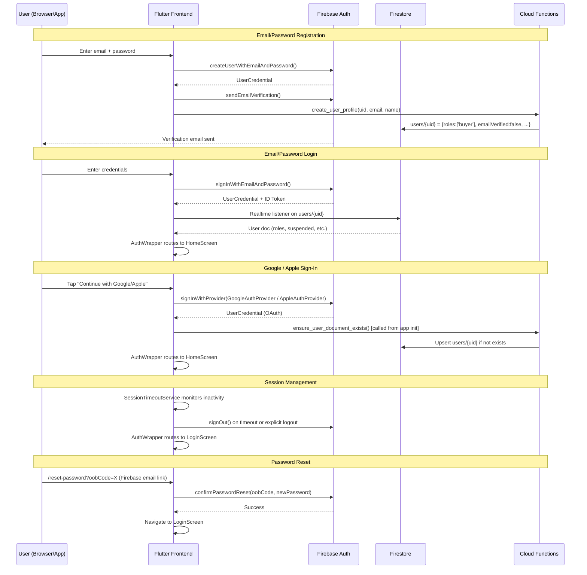

---

## 6. Payment Flow (Complete)

### 6a. Standard Checkout (Card / Sync Payment)

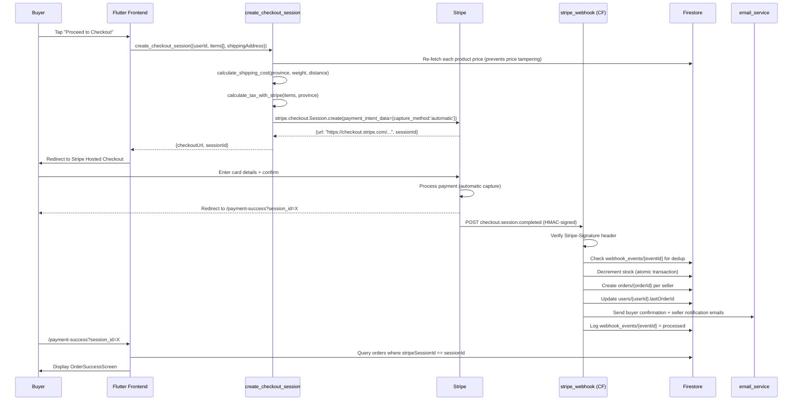

### 6b. Async Payment (Interac / Bank Transfer)

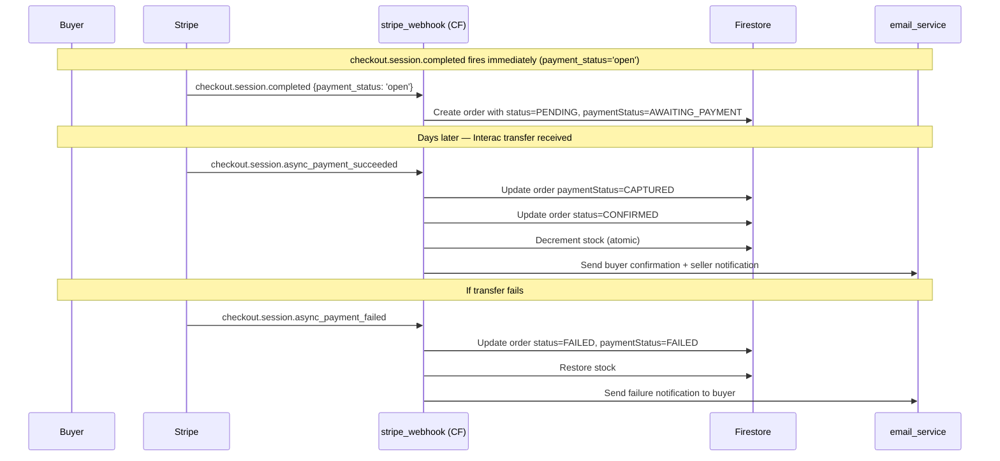

### 6c. Seller Payout Flow

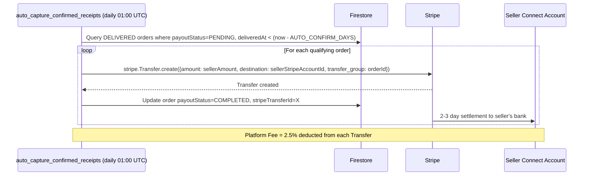

### 6d. Refund Flow

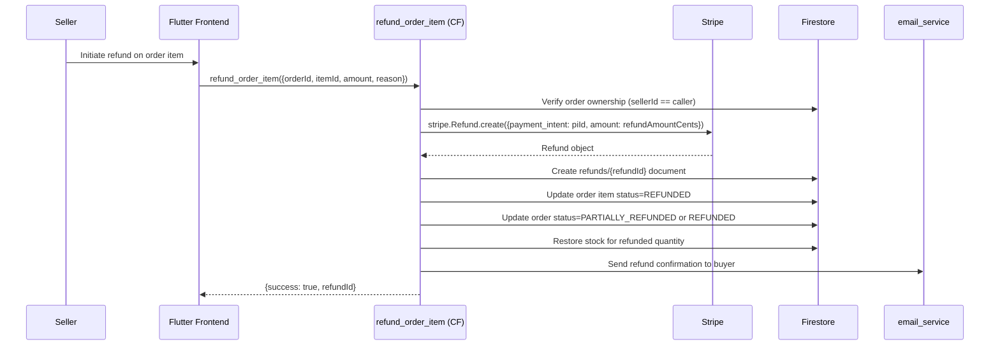

### 6e. Dispute Flow

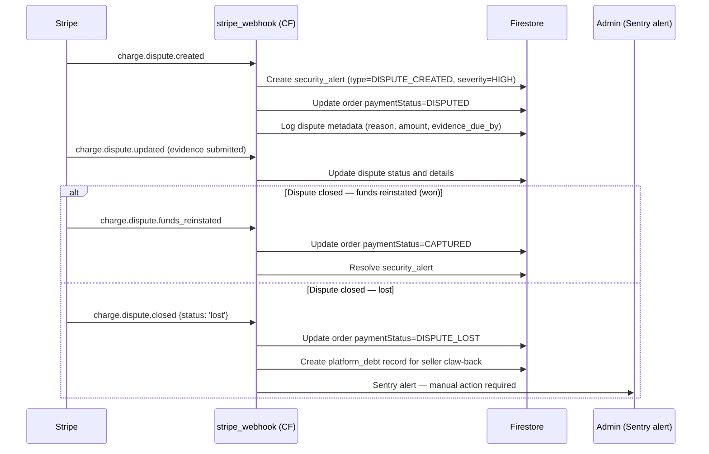

---

## 7. Order Lifecycle State Machine

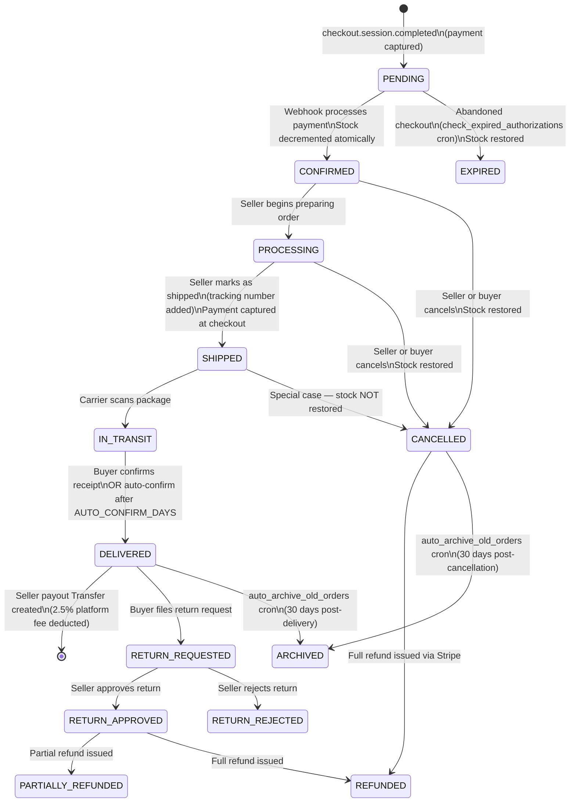

### Payment Status Sub-State Machine

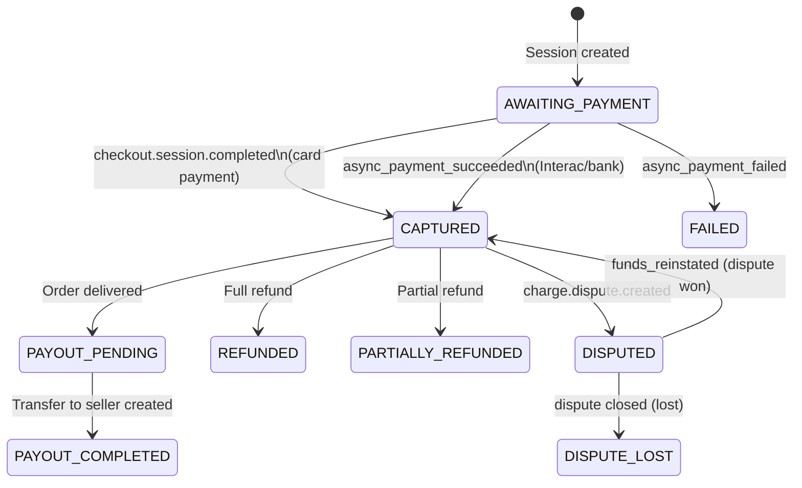

---

## 8. Seller Onboarding Flow

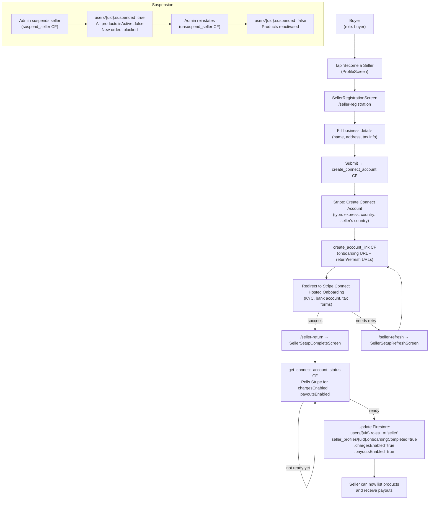

---

## 9. Product Lifecycle

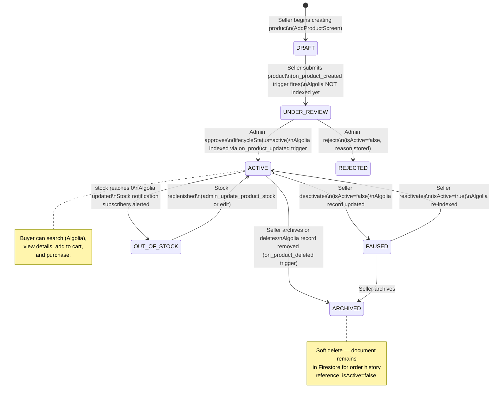

### Product Image Upload Flow

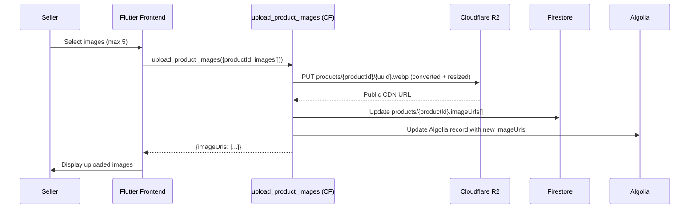

---

## 10. Cron Jobs & Background Processes

| Function | Schedule | Purpose |
|----------|----------|---------|
| `auto_capture_confirmed_receipts` | Daily 01:00 UTC | Creates Stripe Transfers (payouts) to sellers for DELIVERED orders past `AUTO_CONFIRM_DAYS`. Also auto-confirms SHIPPED orders the buyer has not confirmed. |
| `check_expired_authorizations` | Every 1 hour | Cleans up abandoned PENDING orders older than `AUTHORIZATION_EXPIRY_DAYS` (6 days). Restores stock. |
| `auto_archive_old_orders` | Every 12 hours | Archives DELIVERED/CANCELLED orders that are 30+ days old (sets `archived=true`). |
| `monitor_algolia_sync` | Every 15 minutes | Compares Firestore active product count vs Algolia count. Fires Sentry alert if mismatch exceeds 5%. |
| `cleanup_stale_rate_limits` | Every 30 minutes | Deletes `rate_limits` documents with `lastRequest` older than 2 hours. |
| `cleanup_orphaned_r2_images` | Daily 03:00 UTC | Lists all R2 objects under `products/` prefix and deletes any not referenced by a Firestore product document (safety: only deletes files older than 24 hours). |
| `cleanup_stale_webhook_events` | Daily 04:00 UTC | Removes `webhook_events` deduplication records older than 7 days (Stripe replay window). |
| `cleanup_stale_security_alerts` | Daily 05:00 UTC | Archives or purges resolved security alerts older than retention threshold. |
| `retry_failed_algolia_syncs` | Every 1 hour | Processes `algolia_sync_failures` collection — retries up to 3 times with exponential backoff. |
| `check_low_stock_alerts` | Daily 06:00 UTC | Identifies products with stock below threshold. Sends push/email notifications to sellers. |
| `send_abandoned_cart_emails` | Daily 07:00 UTC | Finds users with non-empty carts who have not checked out in 24h and have email consent. Sends CASL-compliant recovery email (one per user, respects `lastCartAbandonEmailAt`). |
| `compute_seller_metrics` | Weekly (every 168 hours) | Aggregates `totalSales`, `totalRevenue`, `avgRating`, `returnRate` per seller. Writes to `seller_metrics/{sellerId}`. |
| `compute_trending_products` | Every 6 hours | Calculates trending product scores based on recent order frequency, views, and ratings. Updates `trendingScore` field and Algolia. |
| `sync_expired_subscriptions` | Daily 08:00 UTC | Cross-checks Stripe subscription status with Firestore `subscriptions` collection. Downgrades users whose subscriptions have lapsed. |
| `escalate_stale_return_requests` | Daily 09:00 UTC | Finds return requests in `PENDING` status older than escalation threshold. Creates Sentry alerts and notifies admin. |

### Distributed Lock Pattern

All cron jobs use a Firestore-based distributed lock (`cron_locks` collection) to prevent duplicate execution across Cloud Function instances:

```
acquire_cron_lock(job_name, ttl_minutes=30)
  → Firestore transaction: SET lock if no active lock within TTL
  → Returns True (acquired) or False (skip — another instance running)

release_cron_lock(job_name)
  → UPDATE status=COMPLETED, completedAt=now
```

---

## 11. Cloud Functions Catalog

### Payment — `payment_stripe.py`

| Function | Trigger | Description |
|----------|---------|-------------|
| `verify_cart_prices` | HTTPS Callable | Server-side price verification before checkout |
| `create_checkout_session` | HTTPS Callable | Creates Stripe Checkout Session with tax, shipping, stock validation |
| `stripe_webhook` | HTTPS Request | HMAC-verified Stripe webhook dispatcher (handles 12+ event types) |
| `create_connect_account` | HTTPS Callable | Creates Stripe Express Connect account for seller |
| `create_account_link` | HTTPS Callable | Generates Stripe Connect onboarding URL |
| `get_connect_account_status` | HTTPS Callable | Polls Stripe for seller's chargesEnabled + payoutsEnabled |

### Orders — `orders.py`

| Function | Trigger | Description |
|----------|---------|-------------|
| `confirm_order_receipt` | HTTPS Callable | Buyer confirms delivery — triggers seller payout |
| `update_order_status` | HTTPS Callable | Seller updates order status (confirmed → processing → shipped) |
| `update_item_status` | HTTPS Callable | Updates individual item status within an order |
| `refund_order_item` | HTTPS Callable | Issues partial or full refund for an order item |
| `cancel_order` | HTTPS Callable | Cancels order, restores stock, initiates refund |
| `approve_shipping_cost` | HTTPS Callable | Buyer approves a custom shipping cost proposed by seller |
| `update_shipping_cost` | HTTPS Callable | Seller proposes a revised shipping cost |
| `on_order_status_changed` | Firestore Trigger | Sends email notifications on order status transitions |
| `create_return_request` | HTTPS Callable | Buyer creates a return/refund request |
| `approve_return_request` | HTTPS Callable | Seller approves return and issues refund |
| `reject_return_request` | HTTPS Callable | Seller rejects return request with reason |

### Products — `products.py`

| Function | Trigger | Description |
|----------|---------|-------------|
| `upload_product_images` | HTTPS Callable | Uploads images to R2, updates Firestore + Algolia |
| `delete_product` | HTTPS Callable | Soft-deletes product, removes from Algolia |
| `submit_product_rating` | HTTPS Callable | Buyer submits rating (requires completed order for product) |
| `configure_algolia` | HTTPS Callable | Admin: configures Algolia index settings/facets |
| `get_products_paginated` | HTTPS Callable | Paginated product listing from Firestore |
| `get_seller_products_paginated` | HTTPS Callable | Seller's own product listing |
| `get_product_ratings_paginated` | HTTPS Callable | Paginated product reviews |
| `on_product_created` | Firestore Trigger | Validates product, syncs to Algolia, sends admin notification |
| `on_product_updated` | Firestore Trigger | Syncs updated product to Algolia |
| `on_product_deleted` | Firestore Trigger | Removes product from Algolia index |
| `subscribe_stock_notification` | HTTPS Callable | User subscribes to out-of-stock product alerts |
| `unsubscribe_stock_notification` | HTTPS Callable | User unsubscribes from stock alerts |
| `ask_product_question` | HTTPS Callable | Buyer posts question on product page |
| `answer_product_question` | HTTPS Callable | Seller answers a product question |
| `get_product_questions` | HTTPS Callable | Retrieves product Q&A list |

### Admin — `admin.py`

| Function | Trigger | Description |
|----------|---------|-------------|
| `update_user_roles` | HTTPS Callable | Admin: assign/revoke buyer/seller/admin roles (MFA-gated for admin role) |
| `suspend_seller` | HTTPS Callable | Admin: suspends seller, deactivates all their products |
| `unsuspend_seller` | HTTPS Callable | Admin: reinstates seller account |
| `admin_update_product_stock` | HTTPS Callable | Admin: manually adjust product stock |
| `admin_mfa_enroll` | HTTPS Callable | Admin: initiate MFA enrollment (TOTP) |
| `admin_mfa_verify` | HTTPS Callable | Admin: verify MFA code |
| `admin_mfa_verify_backup` | HTTPS Callable | Admin: verify backup code |
| `admin_mfa_disable` | HTTPS Callable | Admin: disable MFA |
| `delete_account` | HTTPS Callable | GDPR/PIPEDA: user requests account deletion |
| `export_my_data` | HTTPS Callable | PIPEDA: user requests personal data export |
| `unsubscribe_email` | HTTPS Callable | CASL: one-click email unsubscribe |

### Users — `users.py`

| Function | Trigger | Description |
|----------|---------|-------------|
| `update_user_profile` | HTTPS Callable | Update display name, phone, avatar |
| `get_user_profile` | HTTPS Callable | Retrieve user profile data |
| `update_email_consent` | HTTPS Callable | CASL: update marketing email opt-in/out |
| `update_notification_preferences` | HTTPS Callable | Update push notification preferences |
| `create_user_profile` | HTTPS Callable | Create initial user document on registration |
| `cleanup_fcm_token` | HTTPS Callable | Remove stale FCM token on logout |

### Other Domains

| Domain | Functions | Description |
|--------|----------|-------------|
| **Chat** | `get_or_create_chat`, `send_message`, `mark_messages_read`, `delete_message`, `report_message` | Real-time buyer-seller messaging (Premium only) |
| **Addresses** | `add_buyer_address`, `update_buyer_address`, `delete_buyer_address`, `set_default_buyer_address` | User shipping address CRUD |
| **Digital** | `activate_license`, `deactivate_license`, `generate_book_download_session`, `generate_software_download_session`, `verify_license` | Digital product license management and secure time-limited download sessions |
| **Coupons** | `validate_coupon`, `apply_coupon_to_order`, `admin_create_coupon` | Platform-wide and seller-specific discount coupons |
| **Subscriptions** | `create_premium_subscription`, `cancel_premium_subscription`, `get_subscription_status`, `reactivate_subscription` | Premium membership via Stripe Subscriptions |
| **Shipping** | `calculate_shipping_cost` | Province/distance/weight-based shipping cost calculation |
| **Payment Providers** | `get_payment_providers`, `update_payment_provider`, `get_provider_status` | Admin: enable/disable payment providers (Stripe toggle) |
| **Email Tasks** | `sendEmailTask` | Async email dispatch via Cloud Tasks queue |

---

## 12. Frontend Architecture (MVVM)

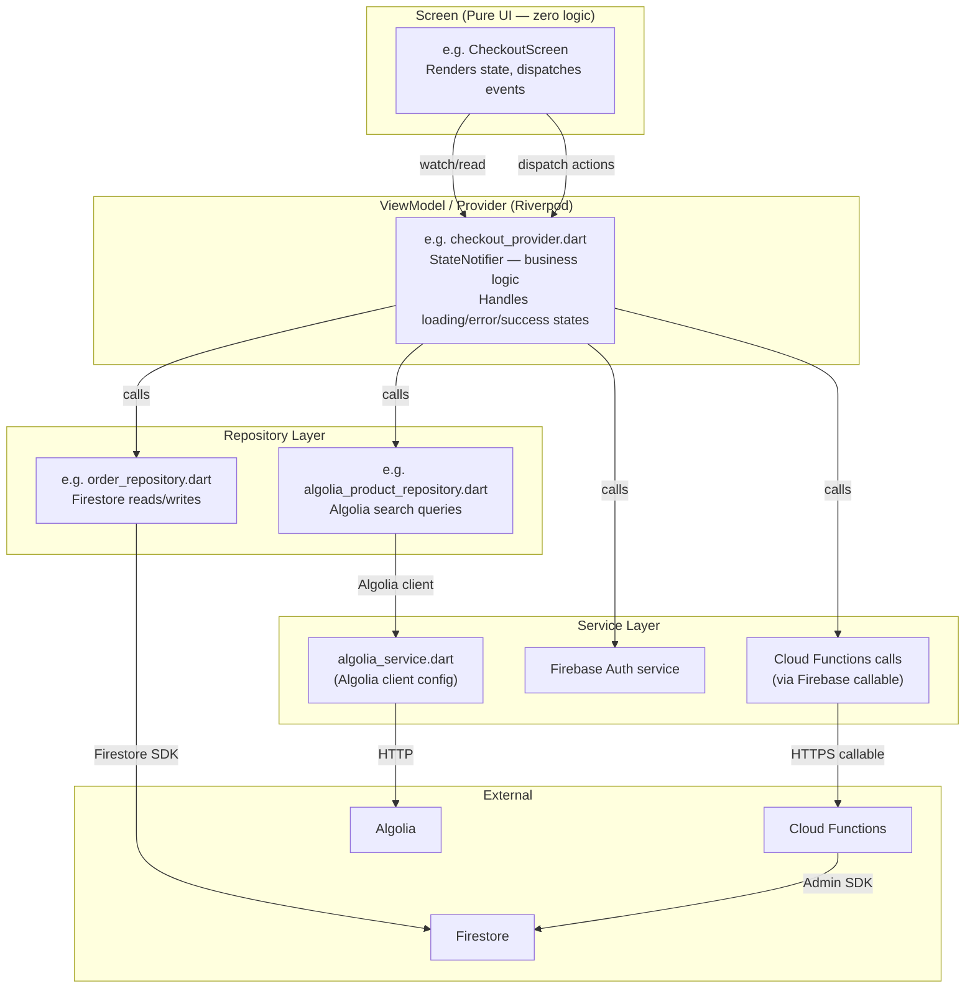

### Provider Hierarchy

```
ProviderScope (root)
├── firebaseAuthProvider       — FirebaseAuth instance
├── firestoreProvider          — FirebaseFirestore instance
├── authRepositoryProvider     — AuthRepository (wraps Firebase Auth + Firestore)
├── currentUserProvider        — Stream<UserModel?> from Firestore
├── cartProvider               — CartNotifier (cart state machine)
├── checkoutProvider           — CheckoutNotifier (orchestrates checkout)
├── homeViewModelProvider      — HomeViewModel (search, filters, pagination)
├── productDetailViewModelProvider(productId)  — lazy product detail
├── buyerOrdersViewModelProvider               — buyer order list
├── sellerOrdersViewModelProvider              — seller order list
├── sellerRegistrationViewModelProvider        — onboarding state
├── subscriptionViewModelProvider              — premium subscription state
└── chatViewModelProvider(productId)           — chat thread state
```

### Deferred Loading (Flutter Web Code Splitting)

Heavy screens are loaded on-demand to reduce initial JS bundle size:

```dart
// Example: CheckoutScreen loaded only when navigating to /checkout
import 'screens/checkout_screen.dart' deferred as checkout;

DeferredWidget(
  loader: checkout.loadLibrary,
  builder: () => checkout.CheckoutScreen(items: args.items, total: args.total),
)
```

Screens loaded deferred: `checkout`, `add_product`, `edit_product`, `seller_registration`, `seller_orders`, `seller_products`, `seller_warehouses`, `seller_integration`, `shipping_approval`, `admin_panel`, `privacy_policy`, `terms_of_service`

---

## 13. Security Architecture

### Layer 1 — Firestore Security Rules

```
firestore.rules enforces:
├── isAuthenticated()          — No anonymous reads on sensitive collections
├── isOwner(userId)            — Users can only read/write their own documents
├── isAdmin()                  — Admin-only collections (config, admin_logs, etc.)
├── isSellerApproved()         — Requires: role=seller + onboardingCompleted + chargesEnabled + payoutsEnabled + NOT suspended
├── hasActivePremium(userId)   — Chat read/write requires active subscription
├── isValidAddress(addr)       — Validates Canadian postal codes + province codes client-side
└── Catch-all deny rule        — match /{document=**} { allow read, write: if false; }
```

### Layer 2 — Backend Validation (Cloud Functions)

```
Every Cloud Function:
├── req.auth verification      — Firebase ID token verified by Firebase Admin SDK
├── Role checks                — hasRole('seller'), hasRole('admin') before privileged ops
├── Input validation           — Pydantic models + manual field checks
├── Price re-fetch             — Products re-read from Firestore; client prices ignored
├── Self-purchase block        — buyer.uid != seller.uid enforced at checkout
├── Stock atomic transactions  — Firestore transactions prevent oversell race conditions
└── Idempotency                — webhook_events dedup prevents duplicate order creation
```

### Layer 3 — Webhook HMAC Verification

```python
# stripe_webhook handler:
sig_header = req.headers.get('Stripe-Signature')
stripe.Webhook.construct_event(payload, sig_header, STRIPE_WEBHOOK_SECRET)
# → raises SignatureVerificationError if tampered
# → raises ValueError if body is invalid JSON
```

### Layer 4 — Rate Limiting

```
rate_limiter.py enforces per-action limits stored in Firestore rate_limits collection:
├── login:            5 attempts / 15 minutes per IP
├── registration:     3 attempts / 1 hour per IP
├── create_checkout:  10 requests / 1 hour per user
├── send_message:     30 messages / 1 minute per user (chat abuse prevention)
└── cleanup_stale_rate_limits cron removes entries > 2 hours old
```

### Layer 5 — MFA for Admin Operations

```
admin_mfa_enroll → TOTP secret generated
admin_mfa_verify → Code verified before role elevation
update_user_roles (to admin) → Requires valid MFA token in request
```

### Security Monitoring

```
Sentry captures:
├── Unhandled Cloud Function exceptions
├── Payment webhook failures
├── Dispute created events
├── Cron job failures (_alert_cron_failure)
└── Price tampering attempts (detected at checkout)

security_alerts collection stores:
├── DISPUTE_CREATED (severity: HIGH)
├── PRICE_TAMPER_ATTEMPT
├── RATE_LIMIT_EXCEEDED
└── SUSPICIOUS_ACTIVITY
```

---

## 14. Canadian Legal Compliance

### Tax (GST/HST/QST/PST)

| Province | Tax Structure | Notes |
|----------|--------------|-------|
| ON, NB, NL, NS, PEI | HST (single tax) | Nova Scotia: 14% |
| BC, MB, SK | GST 5% + PST | Separate calculation |
| QC | GST 5% + QST 9.975% | Stripe Tax for reverse charge |
| AB, YT, NT, NU | GST only | 5% |

- Taxes calculated **server-side** in `create_checkout_session` — not client-manipulable.
- Stripe Tax integration for B2B reverse charge (validated CRA GST numbers).
- Tax on shipping costs included per CRA requirements.
- Category-based exemptions: children's clothing (ON, BC, MB, SK), basic groceries (all provinces).

### PIPEDA (Federal Privacy Law)

- Privacy policy accessible at `/privacy-policy` (detailed 16-section document).
- `export_my_data` Cloud Function: PIPEDA-compliant data portability on request.
- `delete_account` Cloud Function: Right to erasure — removes user data from Firestore and Firebase Auth.
- Email consent stored with timestamp and IP in `users/{uid}` document.

### CASL (Canadian Anti-Spam Legislation)

- All marketing emails require explicit opt-in consent (`emailConsent=true` in users doc).
- Consent timestamp and source recorded at registration.
- One-click unsubscribe endpoint: `unsubscribe_email` Cloud Function.
- `update_email_consent` Cloud Function for user-driven preference changes.
- Abandoned cart emails gated on `emailConsent=true` and respect `lastCartAbandonEmailAt` (no spam flooding).

### Quebec Law 25 / Bill 96

- French language support in product schema: `nameF` (French product name), `descriptionF` (French description) fields.
- UI fully i18n via `easy_localization` with French (fr-CA) locale support.
- `onGenerateTitle: (ctx) => 'app.title'.tr()` — app title is translated.
- French is a supported locale in `MaterialApp.supportedLocales`.
- Compliance note: Law 25 privacy impact assessments and privacy officer designation remain pre-launch tasks per `CANADIAN_LAW_COMPLIANCE_AUDIT.md`.

### Consumer Protection (CPA / Competition Act)

- Products display full price in CAD with no hidden fees until checkout.
- Shipping cost displayed at checkout before payment confirmation.
- Return request flow (`create_return_request`, `approve_return_request`) provides recourse for buyers.
- Terms of Service and Privacy Policy screens accessible without requiring login.

### Accessibility (ACA / AODA)

- Flutter `Semantics` widgets used throughout for screen reader support.
- Playwright E2E tests use `aria-label` selectors (enforced in `WORKFLOW_INDEX.md`).
- `--dart-define=FORCE_SEMANTICS=true` flag available for staging test profile.

---

## Appendix: Environment Configuration

| Environment | Firebase Project | Notes |
|-------------|----------------|-------|
| dev | `orignagta-dev` | Development — tests run against this (no emulators; 8GB RAM constraint) |
| staging | `orignagta-staging` | Playwright E2E tests; `FORCE_SEMANTICS=true` required |
| prod | `orignagta` | www.orignagta.ca — never run Playwright against prod |

## Appendix: Schema Synchronization

The following three files must remain in sync at all times:

```
docs/database_schema.json          ← SOURCE OF TRUTH (v2.3.0, 1421 lines)
functions/schema_constants.py      ← Python mirror (field names, enums, collections)
origna_gta/lib/core/schema/schema_constants.dart  ← Dart mirror
```

---

## Error Code Reference

Every user-facing error in OrignaGTA carries a code in the format `ORIGNA-{DOMAIN}-{NUMBER}`.
Users can quote the code when contacting support. Developers can `grep` the code to find the exact code path.

**Dart constants:** `origna_gta/lib/core/errors/error_codes.dart`
**Python constants:** `functions/schema_constants.py` → `class ErrorCodes`

### AUTH — Authentication

| Code | Dart Constant | Python Constant | Trigger | User Message |
|------|--------------|----------------|---------|--------------|
| ORIGNA-AUTH-001 | `ErrorCodes.authEmailInUse` | `ErrorCodes.AUTH_EMAIL_IN_USE` | Firebase: `email-already-in-use` | Email already registered |
| ORIGNA-AUTH-002 | `ErrorCodes.authWrongPassword` | `ErrorCodes.AUTH_WRONG_PASSWORD` | Firebase: `wrong-password` | Incorrect password |
| ORIGNA-AUTH-003 | `ErrorCodes.authUserNotFound` | `ErrorCodes.AUTH_USER_NOT_FOUND` | Firebase: `user-not-found` | Account not found |
| ORIGNA-AUTH-004 | `ErrorCodes.authWeakPassword` | `ErrorCodes.AUTH_WEAK_PASSWORD` | Firebase: `weak-password` | Password too weak |
| ORIGNA-AUTH-005 | `ErrorCodes.authTooManyRequests` | `ErrorCodes.AUTH_TOO_MANY_REQUESTS` | Firebase: `too-many-requests` | Too many login attempts |
| ORIGNA-AUTH-006 | `ErrorCodes.authGoogleSignInFailed` | — | Google Sign-In failure | Google sign-in failed |
| ORIGNA-AUTH-007 | `ErrorCodes.authAppleSignInFailed` | — | Apple Sign-In failure | Apple sign-in failed |
| ORIGNA-AUTH-008 | `ErrorCodes.authSessionExpired` | `ErrorCodes.AUTH_SESSION_EXPIRED` | Token expired | Session expired, please log in again |
| ORIGNA-AUTH-009 | `ErrorCodes.authMfaRequired` | — | MFA challenge required | Additional verification required |

### PAY — Payments

| Code | Dart Constant | Python Constant | Trigger | User Message |
|------|--------------|----------------|---------|--------------|
| ORIGNA-PAY-001 | `ErrorCodes.payCardDeclined` | `ErrorCodes.PAY_CARD_DECLINED` | Stripe: `card_declined` | Card declined |
| ORIGNA-PAY-002 | `ErrorCodes.payInsufficientFunds` | `ErrorCodes.PAY_INSUFFICIENT_FUNDS` | Stripe: `insufficient_funds` | Insufficient funds |
| ORIGNA-PAY-003 | `ErrorCodes.payExpiredCard` | — | Stripe: `expired_card` | Card expired |
| ORIGNA-PAY-004 | `ErrorCodes.payInvalidCard` | — | Stripe: `incorrect_number` | Invalid card details |
| ORIGNA-PAY-005 | `ErrorCodes.payAmountMismatch` | `ErrorCodes.PAY_AMOUNT_MISMATCH` | Server-side subtotal mismatch | Price mismatch detected |
| ORIGNA-PAY-006 | `ErrorCodes.payCheckoutExpired` | `ErrorCodes.PAY_CHECKOUT_EXPIRED` | Stripe session expired | Checkout session expired |
| ORIGNA-PAY-007 | `ErrorCodes.payRefundFailed` | `ErrorCodes.PAY_REFUND_FAILED` | Stripe refund API error | Refund could not be processed |
| ORIGNA-PAY-008 | `ErrorCodes.paySellerSuspended` | `ErrorCodes.PAY_SELLER_SUSPENDED` | `payment_stripe.py` seller suspended check | Seller currently inactive |
| ORIGNA-PAY-009 | `ErrorCodes.payProductUnavailable` | `ErrorCodes.PAY_PRODUCT_UNAVAILABLE` | `payment_stripe.py` product lifecycle check | Product not available |
| ORIGNA-PAY-010 | `ErrorCodes.payAsyncPending` | — | Async payment pending webhook | Payment is being processed |

### ORD — Orders

| Code | Dart Constant | Python Constant | Trigger | User Message |
|------|--------------|----------------|---------|--------------|
| ORIGNA-ORD-001 | `ErrorCodes.ordNotFound` | `ErrorCodes.ORD_NOT_FOUND` | `orders.py` order lookup | Order not found |
| ORIGNA-ORD-002 | `ErrorCodes.ordCancelNotAllowed` | `ErrorCodes.ORD_CANCEL_NOT_ALLOWED` | `orders.py` archived order | Cannot cancel this order |
| ORIGNA-ORD-003 | `ErrorCodes.ordAlreadyCancelled` | — | Order already in cancelled state | Order already cancelled |
| ORIGNA-ORD-004 | `ErrorCodes.ordReturnWindowExpired` | `ErrorCodes.ORD_RETURN_WINDOW_EXPIRED` | Return window passed | Return window has expired |
| ORIGNA-ORD-005 | `ErrorCodes.ordReturnNotAllowed` | `ErrorCodes.ORD_RETURN_NOT_ALLOWED` | Digital/non-returnable product | This item cannot be returned |
| ORIGNA-ORD-006 | `ErrorCodes.ordStatusInvalid` | — | Invalid state transition | Invalid order status |
| ORIGNA-ORD-007 | `ErrorCodes.ordBiometricFailed` | — | Biometric confirmation failure | Biometric verification failed |

### SHIP — Shipping

| Code | Dart Constant | Python Constant | Trigger | User Message |
|------|--------------|----------------|---------|--------------|
| ORIGNA-SHIP-001 | `ErrorCodes.shipCostCalculationFailed` | `ErrorCodes.SHIP_COST_CALCULATION_FAILED` | Shipping API error | Could not calculate shipping cost |
| ORIGNA-SHIP-002 | `ErrorCodes.shipAddressInvalid` | `ErrorCodes.SHIP_ADDRESS_INVALID` | Invalid Canadian postal code or address | Invalid shipping address |
| ORIGNA-SHIP-003 | `ErrorCodes.shipProviderUnavailable` | — | Carrier API unavailable | Shipping provider unavailable |
| ORIGNA-SHIP-004 | `ErrorCodes.shipApprovalExpired` | — | Shipping approval window expired | Shipping approval expired |
| ORIGNA-SHIP-005 | `ErrorCodes.shipCostTooHigh` | `ErrorCodes.SHIP_COST_TOO_HIGH` | Quoted cost exceeds policy limit | Shipping cost is too high |

### PROD — Products

| Code | Dart Constant | Python Constant | Trigger | User Message |
|------|--------------|----------------|---------|--------------|
| ORIGNA-PROD-001 | `ErrorCodes.prodNotFound` | — | Product document missing | Product not found |
| ORIGNA-PROD-002 | `ErrorCodes.prodOutOfStock` | — | Stock quantity 0 | Product is out of stock |
| ORIGNA-PROD-003 | `ErrorCodes.prodNotAvailable` | — | Lifecycle status != ACTIVE | Product not available |
| ORIGNA-PROD-004 | `ErrorCodes.prodImageUploadFailed` | — | R2/Cloudflare upload error | Image upload failed |
| ORIGNA-PROD-005 | `ErrorCodes.prodInvalidCategory` | — | Unknown category ID | Invalid product category |

### SELL — Sellers

| Code | Dart Constant | Python Constant | Trigger | User Message |
|------|--------------|----------------|---------|--------------|
| ORIGNA-SELL-001 | `ErrorCodes.sellOnboardingIncomplete` | `ErrorCodes.SELL_ONBOARDING_INCOMPLETE` | `payment_stripe.py` onboarding check | Seller onboarding not complete |
| ORIGNA-SELL-002 | `ErrorCodes.sellPayoutsDisabled` | `ErrorCodes.SELL_PAYOUTS_DISABLED` | `payment_stripe.py` payouts_enabled check | Seller payouts not enabled |
| ORIGNA-SELL-003 | `ErrorCodes.sellAccountSuspended` | `ErrorCodes.SELL_ACCOUNT_SUSPENDED` | `payment_stripe.py` suspended check | Seller account suspended |
| ORIGNA-SELL-004 | `ErrorCodes.sellStripeNotConnected` | — | Stripe Connect account missing | Stripe account not connected |

### PERM — Permissions

| Code | Dart Constant | Python Constant | Trigger | User Message |
|------|--------------|----------------|---------|--------------|
| ORIGNA-PERM-001 | `ErrorCodes.permUnauthorized` | `ErrorCodes.PERM_UNAUTHORIZED` | `orders.py` owner check | Unauthorized |
| ORIGNA-PERM-002 | `ErrorCodes.permSellerRequired` | `ErrorCodes.PERM_SELLER_REQUIRED` | `orders.py` seller/admin check | Seller account required |
| ORIGNA-PERM-003 | `ErrorCodes.permAdminRequired` | `ErrorCodes.PERM_ADMIN_REQUIRED` | Admin-only action | Admin access required |
| ORIGNA-PERM-004 | `ErrorCodes.permPremiumRequired` | — | Premium-only feature | Premium subscription required |
| ORIGNA-PERM-005 | `ErrorCodes.permSelfPurchaseBlocked` | `ErrorCodes.PERM_SELF_PURCHASE` | `payment_stripe.py` / `orders.py` self-purchase check | Cannot purchase your own product |

### SYS — System

| Code | Dart Constant | Python Constant | Trigger | User Message |
|------|--------------|----------------|---------|--------------|
| ORIGNA-SYS-001 | `ErrorCodes.sysNetworkError` | `ErrorCodes.SYS_NETWORK_ERROR` | Network connectivity failure | Network error, please retry |
| ORIGNA-SYS-002 | `ErrorCodes.sysServerError` | `ErrorCodes.SYS_SERVER_ERROR` | Unhandled server exception | Server error |
| ORIGNA-SYS-003 | `ErrorCodes.sysTimeout` | — | Request timeout | Request timed out |
| ORIGNA-SYS-999 | `ErrorCodes.sysUnknown` | `ErrorCodes.SYS_UNKNOWN` | Catch-all unknown error | An unexpected error occurred |

Validation command: `./scripts/validate_schema_consistency.sh`
