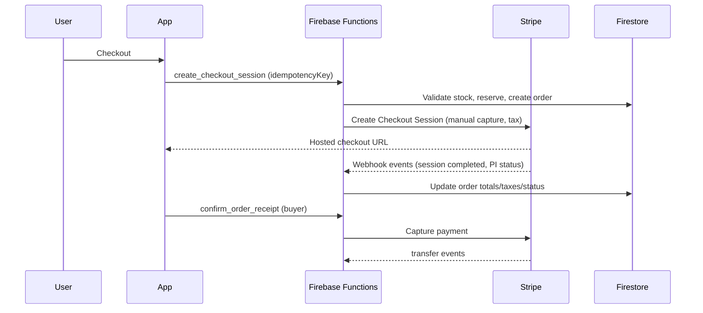
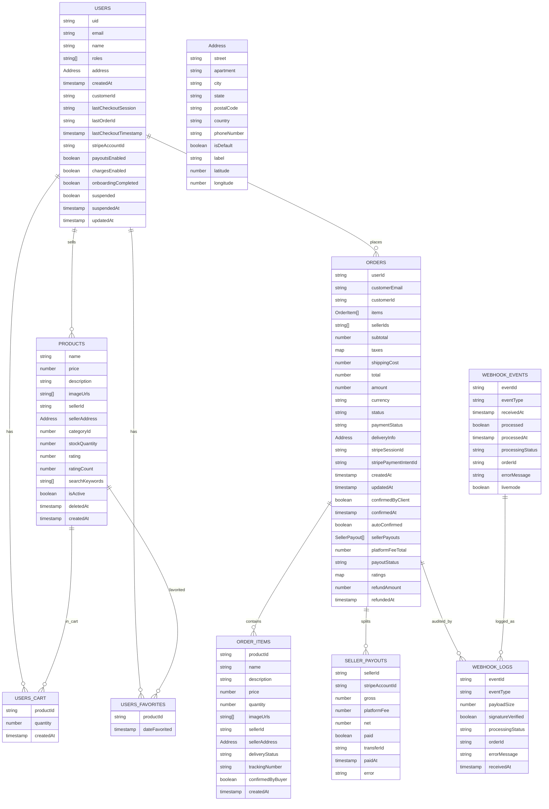

#+#+#+#+ origna_gta (Flutter app)

E-commerce marketplace serving Canadian buyers (Web, Android, iOS) using Firebase + Stripe Connect Express. Sellers can be worldwide.

## Architecture (MVVM)
- UI → ViewModels → Repositories → Firebase/Stripe services
- No business logic in widgets
- Idempotent payments + defensive validation
- Product ratings submitted via Cloud Function (server-validated)

## App flow diagram

## Database diagram (Firestore)

Source complet des champs : docs/database_schema.json

## Setup
1. Flutter: `flutter pub get`
2. Run app: `flutter run`
3. Tests: `../scripts/run_all_tests.sh`
4. Firestore indexes: `firebase deploy --only firestore:indexes`

## Testing
- Fast local unit/widget path:
  - `flutter test`
- Dedicated unit coverage target:
  - `flutter test test/coverage_gate_test.dart --coverage --coverage-path=coverage_unit.info`
- Dedicated integration coverage target:
  - `flutter test integration_test/coverage_gate_integration_test.dart`
- Full strict gate:
  - `../scripts/run_quality_gate.sh`
- Heavy Flutter integration coverage is enforced remotely by:
  - GitHub Actions `Strict Quality Audit` on Linux desktop
  - Codemagic `quality-gate-remote` on macOS
- Local heavy gates are opt-in via:
  - `../scripts/run_quality_gate.sh --allow-local-heavy --backend-gate-mode strict`

## Stripe Connect (direct charges)
- Manual capture authorization
- Capture after shipment/receipt confirmation
- Platform fee: 2.5%

## Stripe test cards
- 4242 4242 4242 4242 (success)
- 4000 0000 0000 9995 (insufficient funds)
- 4000 0000 0000 0002 (generic decline)
- 4000 0025 0000 3155 (3DS required)

Use any future expiry, any CVC, any postal code.

## Current hardening focus
- Keep checkout/order/payment flows green in the remote strict audit.
- Expand integration/device tests around user-visible flows instead of adding logic to widgets.
- Expand threat-model tests for cart/checkout abuse.

